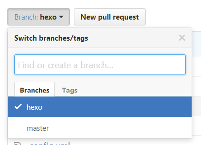
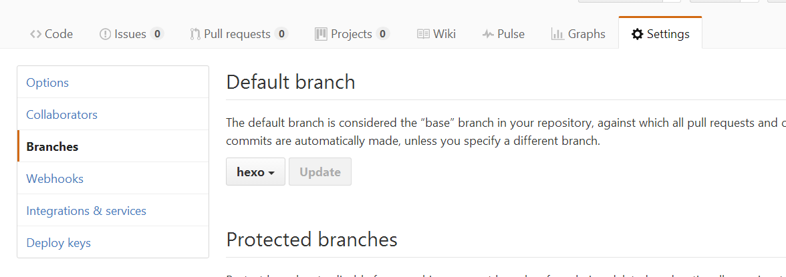
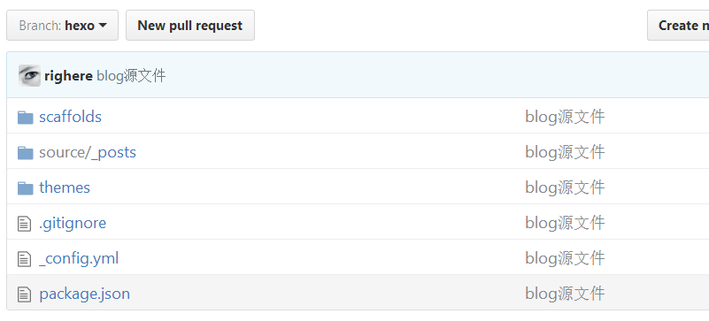

使用Github搭建了个人博客之后，本想随时记录工作中的问题。但是因为Hexo本地编辑，远程部署。所以如果要想达到“随时记录”，还需要做一些在多终端同步的工作。

## 思路： 
通过github的分支，把本地的Hexo源文件推送到github的分支上进行管理。如果要在新的终端上维护更新博客，先和远程的分支同步，然后再推送+部署。

## 步骤：
- 先在远程仓库新建一个branch，比如hexo

- 接着将hexo的分支设为默认，
  

- 将源文件上传到hexo分支

    注意这里有个巨大的坑！！！如果你用的是第三方的主题theme，是使用git clone下来的话，要把主题文件夹下面把.git文件夹删除掉，不然主题无法push到远程仓库，导致你发布的博客是一片空白

初始化本地仓库：

`git init `

添加本地所有文件到仓库： 

` git add -A `

添加commit:
` git commit -m "blog源文件" `

添加本地仓库分支 hexo: 
` git branch hexo `

添加远程仓库：
` git remote add origin git@github.com:yourname/yourname.github.io.git `

将本地仓库的源文件分支hexo强制推送到远程仓库hexo分支：
` git push origin hexo -f `

上传完成之后，我们就拥有了两个远程的分支：master和hexo， 其中master是部署成博客的分支; hexo是我们可以clone到其他电脑或者其他系统的hexo源文件的分支，而且我们已经将它设置成默认仓库;

- 在其他电脑设备上执行clone远程仓库的hexo分支clone到本地

` git clone -b hexo git@github.com:yourname/yourname.github.io.git `

进入本地仓库执行hexo安装： ` npm install `

- 编辑本地的blog之后，编辑发布博客

依次执行 ` git add.  `, ` git commit -m "改了啥" `, ` git push origin hexo `,  同步本地仓库到远程

部署发布博客： ` hexo g `, ` 这样就生成静态网页部署到了github中 `